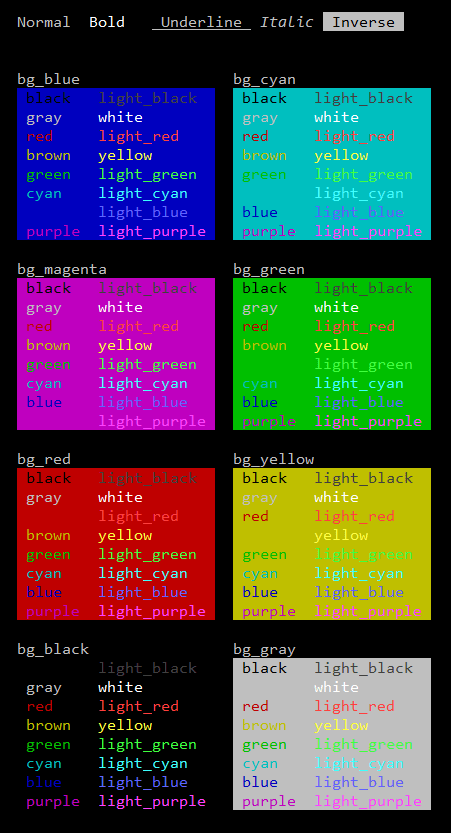
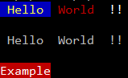

[xperimentX atlas documentation](README.md) 

 

# Cli tools

Command line helper. 

**Cli::Pallete_demo() output**

 

 
## Color properties and Cli::$colors indexes
| dark foreground | light foreground | background | 
|:-----------|:---------------|:----------|
|fg_black    |fg_light_black  |bg_black   |
|fg_red      |fg_light_red    |bg_red     |
|fg_green    |fg_light_green  |bg_green   |
|fg_brown    |fg_yellow       |bg_yellow  |
|fg_blue     |fg_light_blue   |bg_blue    |
|fg_purple   |fg_light_purple |bg_magenta |
|fg_cyan     |fg_light_cyan   |bg_cyan    |
|fg_gray     |fg_white        |bg_gray    |

## Color styles and Cli::$colors indexes

|Style                              |Property/ index |
|:----------------------------------|:---------------|
|**Reset colors and styles**       |**reset**       |
|background reset                   |bg_reset        |
|foreground reset                   |fg_reset        |
|bold / bright                      |bold            |
|bold / bright  unset               |bold_unset      |
|italic                             |italic          |
|underline                          |underline       |
|inverse                            |inverse         |
|bold / bright unset alternative    |bold_unset_2    |
|italic unset                       |italic_unset    |
|underline unset                    |underline_unset |
|normal colors                      |normal_colors   |


## Cli methods

|Cli Methods| |
|:-------|:-----------|
| **Activate_colors** () | Activates the color output    |
| **Deactivate_colors** ()| Deactivates the color output. The colors will be ignored |
| **Color_string** ($string, $foreground_color, $background_color) :string |Returns a colored string |
| **Is_cli_environment** () :bool | Checks that the environment is cli. |
| **Require_cli_environment** () | Ensures that the environment is cli.<br>Dies the program if not is Cli with 403.|
| **Pallete_demo** () :string | Returns the pallete demo|
     

## Sample

```php
$cli = new \Xperimentx\Atlas\Cli();

echo "{$cli->fg_yellow}{$cli->bg_blue} Hello {$cli->reset}",
     "{$cli->fg_red} World {$cli->fg_white} !! {$cli->reset}\n\n";

$cli->Deactivate_colors();

echo "{$cli->fg_yellow}{$cli->bg_blue} Hello {$cli->reset}",
     "{$cli->fg_red} World {$cli->fg_white} !! {$cli->reset}\n\n";

$cli->Activate_colors();

echo $cli->Color_string('Example', 'fg_white', 'bg_red');

```

**Sample output**

 