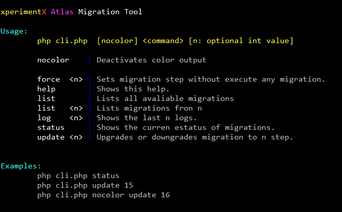
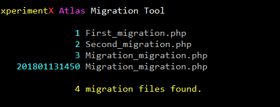

[Documentation](README.md) 
\ [Database reference](Database-reference.md)

 

* [Migrator CLi](#migrator-cli)
* [Database Forge](Database-forge.md)

# Database migrations

The challenge to achieve the objective of migrations has begun. :smiley: 

## Migrator CLi

### Migrator CLi - help

 

### Migrator CLi - migrations list

 
